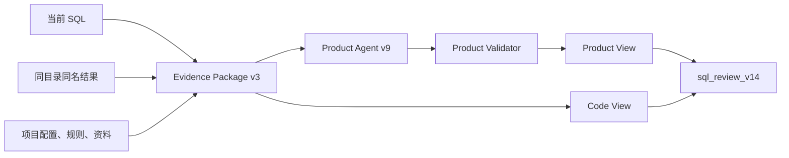

# SQL Review 工具设计

SQL Review 用来审查尚未进入正式仓库的 SQL。它不负责保存正式 QUERY、生成看板资产或修改项目口径。

## 设计目标

审查报告必须同时满足两类读者：

- 产品、DA、需求方能直接看懂 SQL 在算什么、哪里有风险、下一步做什么。
- SQL 工程人员能看到物理表、表达式、血缘、结果文件、规则和性能证据。

两类视角共享同一份事实，不能各自推断一套结论。



## 事实边界

当前输入 SQL 是唯一审查主体。以下信息不能证明 SQL 之间存在关系，也不能证明执行环境：

- 文件名前缀、编号或关键词；
- 文件夹名称和历史目录习惯；
- 标题相似、SQL 相似、共用日志；
- 固定日期、区服值或其他业务常量。

结果文件只按“同一目录 + 完全相同 stem”配对：

```text
candidate.sql
candidate.xlsx
```

`001_query.sql` 不会自动绑定 `001_result.xlsx`，不同目录中的同名文件也不会自动绑定。需要表达代理执行或多 SQL 关系时，必须提供显式角色或上游 lineage。

## 项目角色

报告分别保存：

- `definition_project`：用哪套业务口径审查；
- `execution_project`：结果实际来自哪里；
- `delivery_project`：未来交付到哪里。

执行项目只能来自显式参数、`file_role_map` 或唯一的物理表 profile 证据。多个项目共享相同表 profile 时，状态是 `execution_project_unresolved`。有结果文件不等于已确认执行项目。

## Product View

Product View 默认打开，回答：

1. SQL 回答什么问题？
2. Base 是谁，按什么粒度输出？
3. 每个指标如何计算，分子、分母或统计对象是什么？
4. 哪些事件口径支撑指标？
5. 哪些风险影响哪些指标？
6. 审查人下一步要修 SQL、补证据还是确认业务定义？

主结构：

- 结论与 Base；
- 风险登记 `R1/R2/...`；
- 指标总表和指标卡；
- 事件口径 `E1/E2/...`；
- 公共筛选和待处理动作；
- 折叠证据。

公共风险和事件只写一次，指标通过引用编号关联。页面不能用 CTE 步骤、SQL 公式或静态字段拆解冒充产品解释。

正常报告要求 `semantic_review_status=llm|llm_cached`。模型不可用、输出不完整或出现空洞占位时，页面显示 blocker，不生成看似完整的伪产品报告。

## Code View

Code View 保留：

- 定义、执行、交付角色及推断证据；
- 物理源表、目标表、参数、最终字段；
- CTE、JOIN、窗口、去重和表达式血缘；
- 结果文件列、样例、行数和列对齐；
- 方言、时间、性能和 SQL 侧隐私检查；
- applied rule、真实 conflict 和全部诊断 trace；
- 生命周期与交付门禁。

弱召回、partial、reverse audit、历史候选只进入 Code View。它们不能污染产品口径。

## 与其他流程的关系

| 流程 | 职责 |
|---|---|
| `sql_review.py` | 原始 SQL 的产品/代码审查 |
| `sql_formalize.py` | 已跑 SQL + 真实结果的一次性正式固化 |
| `sql_repository.py` | 正式 QUERY 资产检索与复制 |
| `dashboard_review.py` | 已保存 Dashboard 的 DA 合同审批 |

已有可执行 SQL 和真实结果时，直接 Formalize，不先跑批量 Review。Review 也不会自动把结果推广为正式资产。

## 输出

每个 SQL 目录：

```text
sql_review_product.md
sql_review_code.md
```

批次根目录：

```text
sql_review_summary.md
sql_review.json
sql_review.html
```

HTML 可以通过 `sql_review.py --serve` 动态读取最新 JSON；构建页面不重新分析 SQL，也不调用模型。

## 失败与验收

产品语义失败时应阻断，而不是降级成模板文案。以下行为是固定回归边界：

- 文件名不能选择执行项目；
- 结果只能精确配对；
- 没有执行事实时不能宣称 target reviewed；
- 静态逻辑不能覆盖 LLM 指标、事件和风险；
- Product View 不显示弱规则召回；
- evidence-only 不能作为正式产品报告。

Review 设计的代码级真源见 `sql-engineering/references/sql-review-design-record.md`。
